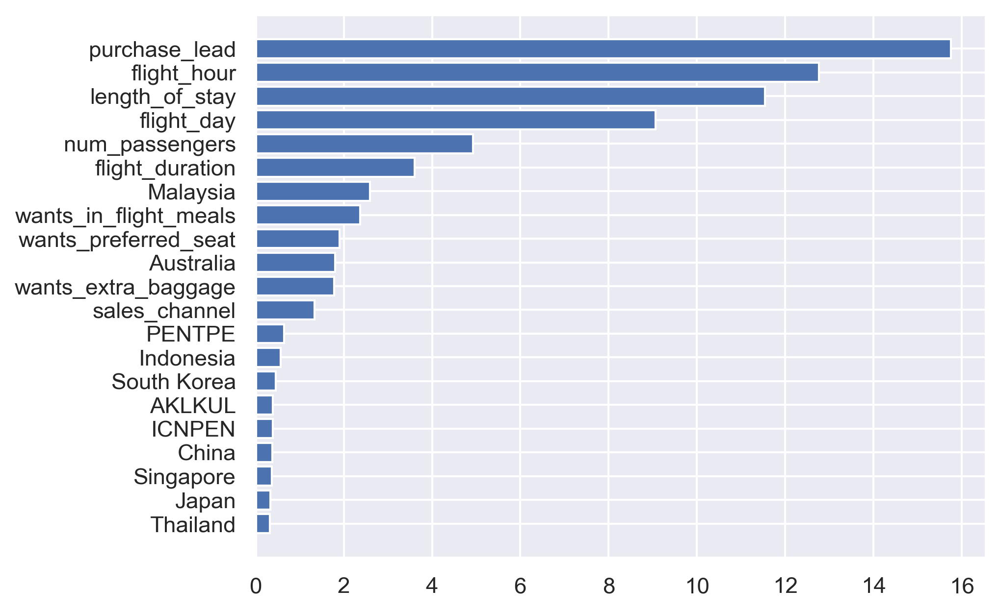

#  Project Title: Predictive Modeling for Airline Ticket Purchase Behavior

##  Objective
The aim of this project is to analyze airline booking data and build a predictive model that can forecast whether a customer will purchase a ticket or not, based on various features like number of passengers, flight time, length of stay, day of flight, and customer details.

##  Dataset Overview
The dataset includes information on:
- Number of passengers
- Purchase lead time (days between booking and flight)
- Length of stay
- Flight schedule details (hour, day)
- Booking channel
- Flight duration
- Country of origin and destination
- Competitor pricing

## 📈 Data Exploration
- Data was loaded and cleaned.
- Exploratory Data Analysis (EDA) was conducted to understand patterns and distributions.
- Visualizations were generated for top countries, booking behaviors, and class distributions.
- Feature importance was derived from a preliminary model.

##  Predictive Modeling
- Implements a classification model using machine learning (Random Forest Classifier).
- Features were selected based on importance ranking.
- Model performance was evaluated using metrics like accuracy, confusion matrix, and classification report.

## ✅ Key Findings
- **Purchase Lead**, **Flight Hour**, and **Length of Stay** were the most influential features.
  
- Accuracy Achieved: - 83.6%
- The model achieved good performance, showing strong ability to predict ticket purchase likelihood.
- Certain regions and booking times had higher booking conversion rates.

##  Conclusion
This project demonstrates how data-driven modeling can assist airlines in understanding customer booking patterns and improving targeting strategies. Future work can explore deep learning models or ensemble techniques to further improve accuracy.
